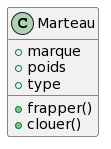
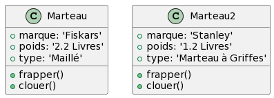

# POO

 <!-- .element width="20%" align="left" -->

 <!-- .element width="30%" align="right" -->

----

## POO
### Définition

- **P**rogrammation **O**rientée **O**bjet
- **Paradigme** de programmation
- Consiste à définir des **objets** et à les faire interagir entre eux

----

## POO
### Histoire

- Apparu dans les années 60 avec Simula 67
- Suivi de Smalltalk
- Percée majeure dans les années 80 avec C++ !
- Puis Java, C#, Python, ...

----

## POO
### Les classes

- Un objet est une **entité** qui possède des **attributs** et des **méthodes**
- **Méthodes** : ce que peut faire l'objet
- **Attributs** : ce qui constitue l'objet
- **Classe** : Modèle qui permet de créer des objets

----

## POO
### Exemple

Un marteau est caractérisé par : 
- Sa marque
- Son poids
- Son Type (marteau, masse, ...)

> Ces informations sont les **attributs** du marteau

----

## POO
### Exemple

Un marteau peut :
- Frapper
- Clouer

> Ce sont les **méthodes** du marteau

----

## POO
### Exemple

En UML, on le représenterai comme suit :

 <!-- .element width="20%" -->

----

## POO
### Classes

- Les classes nous assurent que tous nos objets auront les mêmes attributs et les mêmes méthodes
- On parle aussi de **modèle** ou de **plan**

----

## POO
### Instanciation

- Les objets sont des **instances** de classes
- On peut créer autant d'objets que l'on veut à partir d'une classe
- On dit que l'on **instancie** une classe pour créer un objet

---

# POO
## Piliers

La POO est basée sur 4 piliers :
- **Encapsulation**
- **Héritage**
- **Abstraction**
- **Polymorphisme**

----

## POO
### Encapsulation

- Permet de **protéger**, **cacher** et **sécuriser** les données
- Passe par l'utilisation de méthodes spéciales : **accesseurs** et **mutateurs**
- Implique de définir une portée pour les attributs et les méthodes

> Je n'ai pas besoin de savoir comment fonctionne un moteur pour utiliser une voiture

----

## POO
### Héritage

- Permet de **réutiliser** du code
- Une classe parente (ou **superclasse**) peut être étendue par une classe enfant (ou **sous-classe**)
- La sous-classe hérite des attributs et des méthodes de la superclasse

> Une voiture est un véhicule, elle hérite donc de ses attributs et de ses méthodes

----

## POO
### Abstraction

- Permet de **simplifier** la complexité
- On ne garde que les informations **pertinentes**
- On peut créer des classes abstraites et des interfaces

> Une voiture est un véhicule, mais un véhicule n'est pas forcément une voiture

----

## POO
### Polymorphisme

- Permet de **généraliser** le comportement
- Une méthode peut avoir plusieurs comportements différents

> Faire le plein sur une voiture électrique n'a pas le même comportement que sur une voiture à essence

----

## POO
### Les piliers

> Don't panic !

Nous aborderons ces concepts en détail dans les prochains chapitres !

---

# Java POO - Introduction

 <!-- .element width="20%" align="left" -->

 <!-- .element width="30%" align="right" -->

----

## Java - Histoire
### Green Project

- 1990 : Sun Microsystems lance le projet Green
- Objectif : créer un langage pour les appareils électroniques hétérogènes

> La domotique avant l'heure !

----

## Java - Histoire
### Green Project

- Un bon début en 1992, mais **le marché n'est pas prêt**
- 1994 : Projet recentré sur le Web !

----

## Java - Histoire
### WebRunner

- 1995 : Sortie de WebRunner
- Premier navigateur Web capable d'exécuter du code Java

> Multiplateforme, animations, interactivité, ...

----

## Java - Histoire
### Puis, généralisation

- 1995 : Publication du code source de Java
- 1995 et 1996 : Intégration de Java dans les navigateurs (Netscape, Internet Explorer, ...)

> Java est partout !

----

## Java - De nos jours

- Toujours présent dans les navigateurs !
- Toujours présent dans les applications de bureau !
- Utilisé dans les applications mobiles (Android)
- A inspiré de nombreux langages (C#, JavaScript, TypeScript, ...)

---

# Java - Installation

 <!-- .element width="20%" align="left" -->

 <!-- .element width="30%" align="right" -->

----

## Java
### JDK

- **J**ava **D**evelopment **K**it
- Contient le **J**ava **R**untime **E**nvironment (JRE)
- Contient le **Java** **C**ompiler (javac)

> Le JRE permet d'exécuter du code Java

----

## Java
### JDK

Pour l'obtenir : 
- Sur le site d'[Oracle](https://www.oracle.com/java/technologies/javase-downloads.html)
- Sur le site d'[OpenJDK](https://jdk.java.net/java-se-ri/17)
- Sur le site de [Microsoft](https://learn.microsoft.com/fr-fr/java/openjdk/download)
- Téléchargeable automatiquement via certains IDE !

> Versions majeures : 8, 11 et 17 et 21

----

## Java
### Installation

- Une fois téléchargé, placez le JDK dans un dossier de votre choix (racine de C:, par exemple)
- Ajoutez le chemin du JDK dans la variable d'environnement `PATH`
- Ajoutez `JAVA_HOME` dans les variables d'environnement et pointez vers le dossier du JDK
- Vérifiez que tout fonctionne en ouvrant un terminal et en tapant `java -version`

----

## Java
### IDE : Pick your poison

Il existe plusieurs IDE pour Java :
- [Eclipse](https://www.eclipse.org/downloads/)
- [NetBeans](https://netbeans.apache.org/download/index.html)
- [IntelliJ IDEA](https://www.jetbrains.com/fr-fr/idea/download/)

> Nous utiliserons IntelliJ IDEA !

----

## Java
### IntelliJ IDEA

- Téléchargeable sur le site de [JetBrains](https://www.jetbrains.com/fr-fr/idea/download/)
- Version Ultimate (payante) ou Community (gratuite)

> Étudiant ? Vous pouvez bénéficier de la [version Ultimate gratuitement](https://www.jetbrains.com/community/education/#students) !

----

## Java
### IntelliJ IDEA

- Une fois téléchargé, installez le logiciel
- Lancez IntelliJ IDEA
- Dans File > Project Structure : Sélectionnez le JDK installé précédemment ou téléchargez-en un !

---

## La suite !

[Index](index.html)