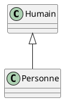
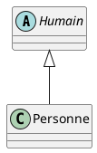

# 4 piliers de la POO

 <!-- .element width="20%" align="left" -->

 <!-- .element width="30%" align="right" -->

----

# 4 piliers de la POO

La POO repose sur 4 piliers :

- Encapsulation
- Abstraction
- Héritage
- Polymorphisme

----

# 4 piliers de la POO

- Ces piliers sont **indissociables**, quel que soit le langage
- En revanche, leur **implémentation** peut varier d'un langage à l'autre

> Si vous les comprenez en Java, vous les comprendrez dans tous les langages !

---

## Les accesseurs

 <!-- .element width="20%" align="left" -->

 <!-- .element width="30%" align="right" -->

----

## Les accesseurs
### Définition

- Avant de nous lancer dans le premier pilier, nous devons parler des **accesseurs**.
- Les **accesseurs** sont des **méthodes** qui permettent d'**accéder** aux **attributs** d'une classe.
- Il existe deux types d'accesseurs :
    - **getters** : permettent de **récupérer** la valeur d'un attribut.
    - **setters** : permettent de **modifier** la valeur d'un attribut.

----

## Les getters
### Définition

- Les **getters** sont des **méthodes** qui permettent de **récupérer** la valeur d'un attribut.
- Ils sont **obligatoires** pour chaque attribut **privé**.
- Ils sont **optionnels** pour chaque attribut **public**.

----

## Les getters
### Syntaxe

- Les getters se déclarent comme des **méthodes** "classiques".
- Ils sont forcément **publics**.
- Ils commence par le mot clé `get` suivi du nom de l'attribut avec une majuscule.

```java
public String getNom() {
    return this.nom;
}
```

----

## Les getters
### Exemple

```java
public class Personne {
    private String nom;
    private String prenom;
    
    public String getNom() {
        return this.nom;
    }
    
    public String getPrenom() {
        return this.prenom;
    }
}
```

> Pourquoi s'embêter et ne pas mettre les attributs en public ?

----

## Les getters
### Intérêt

- Un attribut contient une valeur
- Un **getter** peut contenir de la logique

```java
public class Personne {
    private String nom;
    private String prenom;
    
    public String getNom() {
        return this.nom.toUpperCase();
    }
    
    public String getPrenom() {
        return this.prenom;
    }
}
```

----

## Les getters
### Acces

- Les **getters** sont **publics**.
- Ils sont donc **accessibles** depuis n'importe où.

```java
public class Main {
    public static void main(String[] args) {
        Personne personne = new Personne("Alexandre", "Devos");
        
        System.out.println(personne.getNom());
    }
}
```

----

## Les setters
### Définition

- Les **setters** sont des **méthodes** qui permettent de **modifier** la valeur d'un attribut.
- Ils sont **obligatoires** pour chaque attribut **privé**.
- Ils sont **optionnels** pour chaque attribut **public**.

----

## Les setters
### Syntaxe

- Les setters se déclarent comme des **méthodes** "classiques".
- Ils sont forcément **publics**.
- Ils commence par le mot clé `set` suivi du nom de l'attribut avec une majuscule.

```java
public void setNom(String nom) {
    this.nom = nom;
}
```

----

## Les setters
### Exemple

```java
public class Personne {
    private String nom;
    private String prenom;
    
    public void setNom(String nom) {
        this.nom = nom;
    }
    
    public void setPrenom(String prenom) {
        this.prenom = prenom;
    }
}
```

----

## Les setters
### Intérêt

- Comme pour les getters, un **setter** peut contenir de la logique.

```java
public class Personne {
    private String nom;
    private String prenom;
    
    public void setNom(String nom) {
        if (nom.length() > 2) {
            this.nom = nom;
        } else  {
            throw new IllegalArgumentException("Le nom doit contenir au moins 2 caractères.");
        }
    }
    
    public void setPrenom(String prenom) {
        this.prenom = prenom;
    }
}
```

----

## Accesseurs
### Dans le constructeur

- Il est possible d'utiliser les **setters** dans le **constructeur**.
- C'est utile pour **initialiser** les attributs et **vérifier** les valeurs.

```java
public class Personne {
    private String nom;
    private String prenom;
    
    public Personne(String nom, String prenom) {
        this.setNom(nom);
        this.setPrenom(prenom);
    }
    
    public void setNom(String nom) {
        if (nom.length() > 2) {
            this.nom = nom;
        } else  {
            throw new IllegalArgumentException("Le nom doit contenir au moins 2 caractères.");
        }
    }
    
    public void setPrenom(String prenom) {
        this.prenom = prenom;
    }
}
```

---

# Encapsulation

## Premier pilier

 <!-- .element width="20%" align="left" -->

 <!-- .element width="30%" align="right" -->

----

## Encapsulation
### Définition

- Demandez à n'importe quel développeur, 80% répondront : C'est de mettre des **getters** et des **setters**.
- Ce n'est pas si simple : **encapsulation** = **masquage**.
- L'encapsulation permet de **masquer** les **attributs**/**méthodes** d'une classe afin de **cacher sa complexité**.

----

## Encapsulation
### Définition

- L'accesseur n'est pas l'encapsulation, c'est un **moyen** d'**implémenter** l'encapsulation.
- Si j'utilise un marteau, je ne suis pas un charpentier. Mais si je suis charpentier, j'utilise un marteau.

----

## Encapsulation
### La logique

- Je n'ai pas besoin de savoir comment fonctionne une voiture pour l'utiliser.
- Le fonctionnement du moteur est **caché** sous le capot.
- De mon point de vue, je n'ai besoin que de **connaître** les **méthodes** qui me permettent d'**interagir** avec la voiture.
- Je n'ai pas besoin de savoir comment fonctionne le moteur pour **conduire** la voiture.

----

## Encapsulation
### Cas concrêt

- Vous devez créer un programme de paris en ligne.
- Il est reservé aux personnes majeures.
- Dans le cahier des charges **fonctionnel**, nous avons :

```plantuml
class Personne {
    +nom: String
    +prenom: String
    +age: int
}
```

> Comment cette information sera stockée en BDD ?

----

## Encapsulation
### Cas concrêt

- En BDD, nous n'allons pas stocker l'âge de la personne, mais sa date de naissance.
- Nous allons donc devoir **calculer** l'âge à partir de sa date de naissance.
- Nous allons donc devoir **masquer** la date de naissance et **exposer** l'âge.

> Du coup, avons-nous besoin de l'attribut **age** ?

----

## Démonstration

Résoudre le cas de l'âge

----

## Encapsulation
### Bonnes pratiques

> Faut-il systématiquement mettre ses attributs en privé ?

----

## Encapsulation
### Bonnes pratiques

- Pas nécessairement, mais c'est une bonne habitude à prendre.
- On a pas toujours besoin de masquer ses attributs ou de vérifier leurs valeurs.

> Faites preuve de bonne intelligence !

----

## Encapsulation
### Bonnes pratiques

> Faut-il systématiquement mettre des getters et des setters ?

----

## Encapsulation
### Bonnes pratiques

- **NON** : Mettez des getters et des setters **uniquement** si vous en avez besoin.
- Gardez séparée la logique **interne** de la logique **externe**.

> Si ça fait perdre du temps et n'apporte rien, pourquoi le faire ?

----

## A vous de jouer !

Réalisez le TP 2

---

# Heritage

## Second pilier

 <!-- .element width="20%" align="left" -->

 <!-- .element width="30%" align="right" -->

----

## Heritage

### Définition

- L'**héritage** est un **mécanisme** qui permet de **créer** une **nouvelle classe** à partir d'une **classe existante**.
- La **nouvelle classe** hérite de tous les **attributs** et **méthodes** de la **classe existante** selon leur portée.

----

## Heritage

### Les Superclasses

- La **nouvelle classe** est appelée **sous-classe** ou **classe fille**.
- La **classe existante** est appelée **super-classe** ou **classe mère**.

----

## Heritage

### En UML



> Copiez-collez ce code sur [PlantText](https://www.planttext.com/)

----

## Heritage

### Syntaxe

- Pour hériter d'une classe, on utilise le mot clé `extends` suivi du nom de la classe mère.

```java
public class Humain {
    // ...
}

public class Personne extends Humain {
    // ...
}
```

----

## Heritage

### Portées

- `private` : **non hérité**
- `protected` : **hérité**
- `public` : **hérité**
- `package` : **hérité** si dans le même package, sinon **non hérité**

----

## Heritage

### Exemple

```java
public class Humain {
    protected String nom;
    protected String prenom;
    
    public Humain(String nom, String prenom) {
        this.nom = nom;
        this.prenom = prenom;
    }
    
    public String getNom() {
        return this.nom;
    }
    
    public String getPrenom() {
        return this.prenom;
    }
}

public class Personne extends Humain {
    private String adresse;
    
    public Personne(String nom, String prenom, String adresse) {
        super(nom, prenom);
        this.adresse = adresse;
    }
    
    public String getAdresse() {
        return this.adresse;
    }
}
```

----

## Heritage

### Démonstration !

Des employés et des stagiaires

---

## Overload

### Définition

- Une méthode peut être **redéfinie** plusieurs fois
- On ne touche en général qu'aux paramètres
- On parle d'**overload** (ou **surcharge**)

----

## Overload

### Exemple

```java
public class Humain {
    // ...
    
    public doSomething() {
        // ...
    }
    
    public doSomething(String param) {
        // ...
    }
}
```

> Le comportement doit être similaire, mais les paramètres peuvent être différents !

----

## Surcharge de constructeur

```java
public class Humain {
    // ...

    public Humain() {
        this.nom = "Inconnu";
        this.prenom = "Inconnu";
    }

    public Humain(String nom, String prenom, String adresse) {
        this(nom, prenom);
        this.adresse = adresse;
    }
}
```

----

## Surcharge

### Règles

- On ne peut surcharger que les methodes d'une même classe
- La méthode a le même nom, mais différents paramètres

> La surcharge est définie lors de la compilation

---

## Override

### Définition

- Une méthode héritée peut être **redéfinie** dans la classe fille.
- On parle de **redéfinition** (ou **override**).
- La méthode doit avoir la même signature (même nom, même paramètres) que la méthode héritée.
- Il faut ajouter l'annotation `@Override` au dessus de la méthode.

----

## Override

### Exemple

```java
public class Humain {
    // ...
    
    public String getNom() {
        return this.nom;
    }
    
    public String getPrenom() {
        return this.prenom;
    }
}

public class Personne extends Humain {
    // ...
    
    @Override
    public String getNom() {
        return "M. " + super.getNom();
    }
}
```

----

## Override

### Précisions

- La surcharge est définie lors de l'exécution (runtime)
- Ne fonctionne que lors d'un héritage
- Elle doit avec exactement la même signature (même nom, même paramètres)

----

## Override

### ToString

- La méthode `toString` est héritée de la classe `Object`
- Elle permet de définir la représentation d'un objet sous forme de chaîne de caractères
- Elle est très souvent redéfinie

----

## Override ToString

### Exemple

```java
public class Humain {
    // ...
    
    @Override
    public String toString() {
        return this.nom + " " + this.prenom;
    }
}
```

----

## Override

### Annotation

- L'annotation `@Override` permet de vérifier que la méthode est bien redéfinie
- Si ce n'est pas une méthode héritée, une erreur est levée
- Si la méthode n'a pas la même signature, une erreur est levée
- Il n'est pas obligatoire d'utiliser cette annotation, mais c'est une **bonne pratique** !

---

# Abstraction

## Troisième pilier

 <!-- .element width="20%" align="left" -->

 <!-- .element width="30%" align="right" -->

----

## Classe Abstraite

### Définition

- Désigne une **super-classe** qui ne peut pas être instanciée.
- Elle sert de **modèle** pour les **sous-classes** qui l'étendent.

----

## Classe Abstraite

### Objectifs

- **Factoriser** du **code** commun à plusieurs classes.
- **Simplifier** la **compréhension** du code.
- Créer un comportement **générique**.

----

## Classe Abstraite

### En UML



----

## Classe Abstraite

### Syntaxe

- On utilise le mot clé `abstract` devant la déclaration de la classe.

```java
public abstract class Humain {
}
```

----

## Classe Abstraite

### Syntaxe

Elle peut aussi contenir des méthodes abstraites :

```java
public abstract class Humain {
    public abstract void parler();
}
```

> Les sous classes devront alors implémenter cette méthode !

----

## Classe Abstraite

### Syntaxe

- Les implémentations devront respecter la signature de la méthode abstraite.

```java
public class Personne extends Humain {
    @Override
    public void parler() {
        System.out.println("Bonjour !");
    }
}
```

----

## Classe Abstraite

### Exemple

```java
public abstract class Humain {
    protected String nom;
    protected String prenom;
    
    public Humain(String nom, String prenom) {
        this.nom = nom;
        this.prenom = prenom;
    }
    
    public String getNom() {
        return this.nom;
    }
    
    public String getPrenom() {
        return this.prenom;
    }
    
    public abstract void parler();
}

public class Personne extends Humain {
    private String adresse;
    
    public Personne(String nom, String prenom, String adresse) {
        super(nom, prenom);
        this.adresse = adresse;
    }
    
    @Override
    public void parler() {
        System.out.println("Bonjour !");
    }
}
```

----

## Démonstration

Améliorer notre code !

---

# Interface

 <!-- .element width="20%" align="left" -->

 <!-- .element width="30%" align="right" -->

----

## Interface

### Définition

- Une interface est une **classe abstraite** dont toutes les méthodes sont abstraites.
- Elle sert à définir des abstractions sans implémentation
- Une interface ne peut pas être instanciée

----

## Interface

### Contrat

- Une interface définit un **contrat**.
- Une classe qui implémente une interface doit respecter ce contrat.
- Le contrat désigne les **méthodes** que la classe doit implémenter.

----

## Interface

### Syntaxe

```java
public interface Humain {
    public void parler();
}
```

- On utilise le mot clé `interface` devant la déclaration de la classe.
- Les méthodes n'ont pas de corps `{}`.
- On ne peut pas définir de constructeur.

----

## Interface

### Attributs

- Il est possible (mais pas recommandé) de définir des attributs.
- Les attributs sont **publics**, **statiques** et **constants**.
- Une fois hérités, ils ne peuvent pas être redéfinis.

```java
public interface Humain {
    public static final String NOM = "Humain";
}
```

> Évitez de définir des attributs dans une interface !

----

## Interface

### Accesseurs

- Il est également **possible** de définir des **accesseurs**.
- Ils sont **publics** et **abstraits**.
- Il y a 2 écoles : ceux qui sont pour et ceux qui sont contre.

```java
public interface Humain {
    public abstract String getNom();
}
```

> C'est toujours une question de conception !

----

## Interface

### La team "Contre"

- En Java, les interfaces sont **utilisées** pour définir des **compotements**.
- Les attributs, accesseurs et mutateurs sont des **détails d'implémentation**.
- Il est donc préférable de les définir dans une classe concrète, voire abstraite.

> Cette affirmation n'est pas vraie dans tous les langages !

----

## Interface

### La team "Pour"

- Les interfaces sont là pour définir un **contrat**.
- Les getters/setters étant publiques, ils font partie du contrat.
- De plus, on manipule les objets via leurs interfaces, et pas leurs classes abstraites/concrètes.

----

## Interface

### Nomenclature

Il n'est pas rare de voir ce genre de choses :

```java
public interface IPersonne {
    // Code
}

public class Personne implements IPersonne {
    // Code
}
```

> Bien ou pas bien ?

----

## Interface

### Nomenclature

- C'est une pratique ancienne.
- Les interfaces étaient préfixées avec un `I` pour aider les développeurs à les identifier.
- Hors, les interfaces sont là pour définir un comportement **métier**. `I` est une **notation technique**.

> En Java, il est donc inutile de préfixer les interfaces avec un `I` !

Note: https://stackoverflow.com/questions/5816951/prefixing-interfaces-with-i#:~:text=The%20%22I%22%20in%20front%20of,everyone%20expects%20you%20to%20do.

----

## Interface

### Nomenclature

- Aujourd'hui, c'est considéré comme une mauvaise pratique.
- Cependant, beaucoup de développeurs continuent de le faire, par **habitude**.

> NB : C# est une exception, car c'est une bonne pratique dans **ce** langage.

----

## Interface

### Du coup, on fait quoi ?

- On cherche des noms représentatifs !
- On réfléchit à la **sémantique** de l'interface.
- On réfléchit à la **conception**.

```java
public interface Humain {
    // ...
}
public class Personne implements Humain {
    // ...
}
```

----

## Interface

### Démonstration

Reprenons notre code depuis le début !

---

# Polymorphisme d'héritage

## Quatrième pilier

 <!-- .element width="20%" align="left" -->

 <!-- .element width="30%" align="right" -->

----

## Polymorphisme d'héritage

### Définition

- Poly : plusieurs
- Morphisme : forme

----

## Polymorphisme d'héritage

### Définition

- Mécanisme qui indique qu'une **même méthode** peut avoir des **comportements différents** selon le contexte.
- En occurrence, selon le type de l'objet qui l'appelle.

> L'implémentation des méthodes d'une interface est différente selon la classe qui l'implémente.

----

## Polymorphisme d'héritage

### Ca vous dit quelque chose ?

- Nous avons déjà utilisé le polymorphisme !
- Par exemple, concernant la méthode `travailler()` de l'interface `Employe`
- L'implémentation était alors différente selon le type d'employé.
----

## Polymorphisme d'héritage

### Exemple

- Prenons 4 formes géométriques : un triangle rectangle, un carré, un cercle et un rectangle.
- Chacune de ces formes possède une méthode `aire()` qui calcule son aire.
- Le calcul de l'aire est différent selon la forme !

> Le polymorphisme se base sur ce simple concept !

----

## Polymorphisme d'héritage

### Exemple

```java
public interface Forme {
    public double aire();
}
```

```java
public class TriangleRectangle implements Forme {
    private double base;
    private double hauteur;

    public Triangle(double base, double hauteur) {
        this.base = base;
        this.hauteur = hauteur;
    }

    @Override
    public double aire() {
        return (base * hauteur) / 2;
    }
}
```

----

## Polymorphisme d'héritage

### Exemple

```java
public interface Forme {
    public double aire();
}
```

```java
public class Carre implements Forme {
    private double cote;

    public Carre(double cote) {
        this.cote = cote;
    }

    @Override
    public double aire() {
        return cote * cote;
    }
}
```

----

## Polymorphisme d'héritage

### Exemple

```java
public interface Forme {
    public double aire();
}
```

```java
public class Rectangle implements Forme {
    private double longueur;
    private double largeur;

    public Rectangle(double longueur, double largeur) {
        this.longueur = longueur;
        this.largeur = largeur;
    }

    @Override
    public double aire() {
        return longueur * largeur;
    }
}
```

----

## Polymorphisme d'héritage

### Exemple

```java
public interface Forme {
    public double aire();
}
```

```java
public class Cercle implements Forme {
    private double rayon;

    public Cercle(double rayon) {
        this.rayon = rayon;
    }

    @Override
    public double aire() {
        return Math.PI * rayon * rayon;
    }
}
```

----

## Polymorphisme d'héritage

### Exemple

- Puisque toutes nos formes implémentent l'interface `Forme`, nous pouvons les stocker dans une liste de `Forme` !

```java
public class Main {
    public static void main(String[] args) {
        List<Forme> formes = new ArrayList<>();
        formes.add(new Triangle(10, 5));
        formes.add(new Carre(5));
        formes.add(new Rectangle(10, 5));
        formes.add(new Cercle(5));

        for (Forme forme : formes) {
            System.out.println("Aire : " + forme.aire());
        }
    }
}
```

> Le polymorphisme permet de simplifier le code !

---

## A vous de jouer !

Réalisez le TP 3