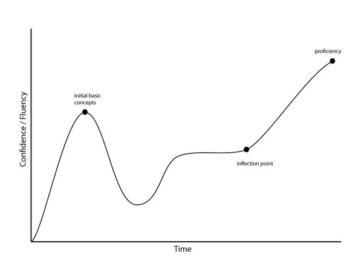
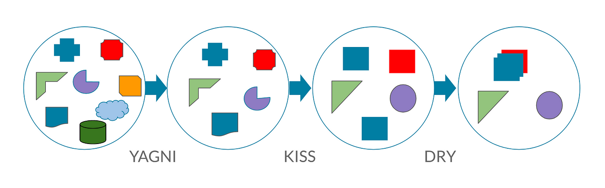
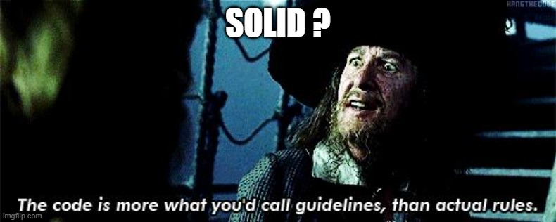

# Bonnes pratiques

 <!-- .element width="20%" align="left" -->

 <!-- .element width="30%" align="right" -->

----

## Bonnes pratiques

### Introduction

- N'oubliez pas que vous ne codez pas pour vous, mais pour un **client**
- Vous ne codez pas seul, mais **en équipe** !
- Il faut donc que votre code soit compréhensible par tous

> Partez du principe que votre lecteur aura 3 de QI et 2 de tension !

----

## Bonnes pratiques

### Le métier de Dev

Quel est le métier d'un développeur ? Taper du code ?

----

## Bonnes pratiques

### Le métier de Dev

- Votre métier est de **trouver des solutions** pour **répondre à un besoin**
- Taper du code n'est qu'un moyen d'y arriver !

----

## Bonnes pratiques

### Un bon développeur

- **Tout le monde peut taper du code**
- Mais un bon développeur sait **bien** taper du code

> Vous savez nager, ou avancer dans l'eau ?

----

## Bonnes pratiques

### Analogie du conducteur : Le pilote

Une personne capable de conduire une voiture à 200km/h sans accident est-elle un bon conducteur ?

----

## Bonnes pratiques

### Analogie du conducteur : Le probe

Une personne qui respecte les limitations de vitesse, mets ses clignotants, ne téléphone pas au volant... Est-elle un bon conducteur ?

> Probe = Personne qui respecte les règles

----

## Bonnes pratiques

### Analogie du conducteur

Ce qui est sûr avec le pilote :
- Je ne voudrais pas monter dans sa voiture
- Je ne voudrais pas partager la route avec lui

> C'est un **joueur solo**

----

## Bonnes pratiques

### Le pilote dans le dev

- Il code vite, mais seul
- Difficile de comprendre son code
- Ça sort vite... au début !
- À terme, le code devient illisible, incompréhensible, et inutilisable

> Le pilote est un **mauvais** développeur

----

## Bonnes pratiques

### Le pilote dans le dev

- Peu importe ses compétences techniques
- Peu importe son expérience
- Il est un **mauvais** développeur

> Parfois appelé "Pisseur de code"

----

## Bonnes pratiques

### La légende de Microsoft

- On raconte que les développeurs de Microsoft tapent en moyenne 10 lignes de code par jour
- Le reste du temps est consacré à la réflexion, la conception, la documentation, les tests, etc...

> Ne foncez pas sans réfléchir !

----

## Bonnes pratiques

### Ne confondez pas

- Technique et qualitatif
- Vitesse et qualité

> Il faut savoir prendre son temps !

----

## Bonnes pratiques

### Quelques rappels

- Une fonction < 25 lignes
- Une fonction = 1 action
- Des noms de variables et fonctions **explicites**
- Des commentaires **pertinents** et une documentation **complète**
- Des **tests unitaires**, autant que possible !

---

# KISS

 <!-- .element width="20%" align="left" -->

 <!-- .element width="30%" align="right" -->

----

## KISS

Selon les versions :

- **K**eep **I**t **S**tupid **S**imple
- **K**eep **I**t **S**hort and **S**imple

> Ma préféré : **K**eep **I**t **S**imple, **S**tupid

----

## KISS

### Définition

- Principe de conception, programmation
- Veut que plus un code est simple, plus il est facile à maintenir

----

## KISS

### Mantra

- Répondez toujours aux problèmes **aussi simplement que possible**
- L'optimisation ne doit être faite que si elle est **nécessaire**, et **dans un second temps**

> Objectif : le stagiaire doit pouvoir comprendre votre code !

----

## KISS

### En étapes

1. Je traite le problème de manière simple
2. Je teste
3. Je 'refactor' mon code (doc, découpage, nommage, ...)
4. Je teste à nouveau

> C'est un des principes de la TDD !

----

## KISS

### Mise en garde

- Ne pas confondre **simplicité** et **facilité**
- Tout doit être aussi simple que possible pour répondre au besoin
- Mais pas simple pour faire simple !

----

## KISS

### À avoir en tête

- Le code est lu plus souvent qu'il n'est écrit
- Le code est lu par des humains, qui ne sont pas vous
- Dans un mois, vous aurez oublié ce que vous avez fait !
- Pensez à la documentation et l'auto-documentation

> Résolvez un problème complexe avec pleins de solutions simples !

----

## KISS

### Confidence Curve



----

## KISS

### Learning Curve

- La complexité de votre code évoluera en même temps que votre connaissance du sujet
- Plus vous en saurez, plus vous voudrez faire des choses complexes
- Demandez-vous : Quand complexifier et quand simplifier ?

---

# DRY

 <!-- .element width="20%" align="left" -->

 <!-- .element width="30%" align="right" -->

----

## DRY

### Définition

- **D**on't **R**epeat **Y**ourself
- Ne vous répétez pas

----

## DRY

### Concept

- Concept évident, mais pourtant souvent oublié
- De manière générale : **EVITEZ LES COPIER/COLLER** !

----

## DRY

### Conception

- Si un code est utilisé deux fois :
    - Il peut être déplacé dans une classe utilitaire ?
    - Le diagramme de classe peut être revu ?
    - Y a-t-il des outils/moyens de le généraliser ?

---

# YAGNI

 <!-- .element width="20%" align="left" -->

 <!-- .element width="30%" align="right" -->

----

## YAGNI

### Définition

- **Y**ou **A**ren't **G**onna **N**eed **I**t
- Vous n'en aurez pas besoin

----

## YAGNI

### Concept

- Anticiper, c'est bien, mais dans une certaine limite !
- Codez uniquement ce dont vous avez besoin **maintenant**
- Ne cherchez pas à (trop) anticiper les besoins futurs !

----

## YAGNI

### En image

 <!-- .element width="40%" -->

----

## YAGNI

### Un juste milieu

- 'YAGNI' ne veut pas dire ne pas découper son code !
- L'objectif est de rester concis, efficace
- Et surtout : de ne pas se disperser !

> Quand les muses du dev vous inspirent, il faut savoir quand les écouter !

---

## DRY, KISS, YAGNI



---

## Aggrégation et composition

 <!-- .element width="20%" align="left" -->

 <!-- .element width="30%" align="right" -->

----

## Composition

### Définition

- Type de relation
- Une classe est composée d'une ou plusieurs autres classes
- Indique une dépendance **forte** entre les deux classes

----

## Composition

### Exemple

- Un humain est composé d'un cerveau, d'un cœur, d'un foie, ...
- Si l'un de ces organes est détruit, l'humain meurt
- L'humain est donc composé de ces organes

----

## Composition

### Le problème

- Si l'humain meurt, tous les organes ne meurent pas
- Certains peuvent être utilisés par d'autres êtres vivants
- Les organes ne sont pas tous dépendants de **cet** humain

> Le foie, le cœur ... peuvent être transplantés !

----

## Composition

### En Java

- Une classe peut être composée d'une ou plusieurs autres classes
- La classe composée est une **propriété** de la classe qui la contient
- La classe composée est **instanciée** dans le constructeur de la classe qui la contient

----

## Composition

### En Java

```java
public class Humain {
    private Cerveau cerveau;
    private Coeur coeur;

    public Humain() {
        this.cerveau = new Cerveau();
        this.coeur = new Coeur();
    }

    // Code ...
}
```

> Quel serait le problème avec cette implémentation ?

----

## Composition

### Réponse

- Si l'humain meurt, le cœur et le cerveau meurent aussi
- Hors, le cœur n'est pas dépendant de l'humain (contrairement au cerveau)
- Si le cœur meurt, l'humain meurt aussi
- Dans le code, le moindre problème avec une des relations rendra le code inutilisable

----

## Aggrégation

### Définition

- Type de relation
- Une classe possède une ou plusieurs autres classes en tant que propriété
- Ils peuvent exister indépendamment, et réaliser des actions indépendantes

----

## Aggrégation

### Exemple

- Un humain possède un ordinateur
- L'humain peut vivre sans ordinateur
- L'ordinateur peut être utilisé par d'autres êtres vivants
- Il peut le vendre, le jeter, le remplacer, ou ne pas en avoir du tout

----

## Aggrégation

### En Java

- Une classe peut posséder une ou plusieurs autres classes en tant que propriété
- La classe possédée est une **propriété** de la classe qui la contient
- Elle n'est pas **instanciée** dans le constructeur de la classe qui la contient :
    - Elle est instanciée ailleurs
    - Elle est passée en paramètre du constructeur de la classe qui la contient

----

## Aggrégation

### En Java

```java
public class Humain {
    private Ordinateur ordinateur;

    public Humain(Ordinateur ordinateur) {
        this.ordinateur = ordinateur;
    }

    // Code ...
}

public class Ordinateur {
    // Code ...
}

public class Main {
    public static void main(String[] args) {
        Ordinateur ordinateur = new Ordinateur();
        Humain humain = new Humain(ordinateur);
    }
}
```

----

## Aggrégation et composition

### Que choisir ?

- Il n'y a pas de bonne réponse : Ça dépend du contexte !
- De manière générale, il faut privilégier l'**aggrégation**
- La composition est à utiliser avec parcimonie, que si c'est nécessaire !

---

# SOLID

 <!-- .element width="20%" align="left" -->

 <!-- .element width="30%" align="right" -->

----

## SOLID

### Définition

- Acronyme qui reprend 5 principes de conception :
    - **S**ingle Responsibility Principle
    - **O**pen/Closed Principle
    - **L**iskov Substitution Principle
    - **I**nterface Segregation Principle
    - **D**ependency Inversion Principle

----

## SOLID

### Objectif

- Permettre de créer des classes plus facilement maintenables, évolutives et testables
- Se concentre sur la conception des classes
- Doivent être appliqués **autant que possible**

----

## SOLID



----

## SOLID

### Mise en garde

- Ces principes ne sont pas des règles absolues
- Il y a des cas où l'on n'a "pas le choix" de les enfreindre
- Le tout est de savoir quand et comment, et pourquoi !

---

## SRP

### Premier principe

 <!-- .element width="20%" align="left" -->

 <!-- .element width="30%" align="right" -->

----

## SRP

### Définition

- **S**ingle **R**esponsibility **P**rinciple
- Principe de responsabilité unique

----

## SRP

### Concept

- Une classe ne doit avoir qu'une seule responsabilité
- La responsabilité est encapsulée dans la classe

> Objectif : Diminuer la complexité de la classe !

----

## SRP

### Ne pas respecter le SRP

- Au début : tout va bien
- Puis, le besoin évolue...
    - La classe doit être modifiée
    - La classe devient plus complexe, puis une usine à gaz !

----

## SRP

### Les God Objects

- Désigne une classe qui fait tout
- C'est un anti-pattern !
- Une dérive du SRP, malheureusement très courante

----

## SRP

### Plus facile à dire qu'à faire

- Très facile à identifier sur du code existant
- Plus difficile à anticiper sur du code à écrire

> Faites vos diagrammes en amont !

----

## SRP

### Avantages

- Code plus simple à maintenir
- Code plus simple à tester
- Code plus simple à comprendre
- Meilleure satisfiability
- Facilite le développement parallèle
- Moins de risque d'introduire des bugs

----

## SRP

### Inconvénients

- Plus de classes
- Risque d'**over-engineering**
- Difficile de granulariser les responsabilités

----

## SRP

### Exemple

Ça ne fait pas un peu trop ?!

```java
public class User {
    private String name;
    private String email;
    private String password;
    private String address;
    private String phone;
    private String bio;
    private String avatar;
    private String website;
    private String twitter;
    private String facebook;
    private String instagram;
    private String linkedin;
    private String github;

    // Code ...
}
```

----

## SRP

### Exemple

```java
public class User {
    private Identity identity;
    private Contact contact;
    private Social social;
    private Credentials credentials;
    // Méthodes ...
}

public class Credentials {
    private String email;
    private String password;
    // Méthodes ...
}

public class Identity {
    private String name;
    private String bio;
    private String avatar;
    // Méthodes ...
}

public class Contact {
    private Address address;
    private String phone;
    private String website;
    // Méthodes ...
}

public class Social {
    private String twitter;
    private String facebook;
    private String instagram;
    private String linkedin;
    private String github;
    // Méthodes ...
}

public class Address {
    private String street;
    private String city;
    private String zipCode;
    private String country;
    // Méthodes ...
}
```

----

## SRP

### Aller plus loin

- Si le SRP est pensé pour les classes, il peut aussi s'appliquer aux méthodes !
- Une méthode ne doit avoir qu'une seule responsabilité
- Si une méthode fait trop de choses, il faut la découper
- Si une méthode est trop longue, il faut la découper

----

## SRP

### Aller plus loin

- Il peut aussi s'appliquer aux composants FRONT
- Il n'est responsable que d'un élément
- Il peut être découpé en d'autres composants

----

## SRP

### Architecture

- Le SRP peut aussi s'appliquer à l'architecture
- Un Front est responsable de l'affichage **uniquement**
- Un Back est responsable de la logique **uniquement**
- Une BDD est responsable de la persistance des données **uniquement**

> Tout est lié !

---

## OCP

 <!-- .element width="20%" align="left" -->

 <!-- .element width="30%" align="right" -->

----

## OCP

### Définition

- **O**pen/**C**losed **P**rinciple
- Principe ouvert/fermé

----

## OCP

### Concept

- Une classe doit être ouverte à l'extension
- Une classe doit être fermée à la modification

> En théorie, une classe ne doit jamais être modifiée une fois écrite !

----

## OCP

### Objectif

- Encore et toujours la **maintenabilité** et l'**évolutivité**
- Une classe doit pouvoir être étendue (héritage) modifier son comportement

> On parle de nouvelles fonctionnalités, pas de correction de bugs !

----

## OCP

### Généralement

- Le principe **OCP** est souvent associé au principe **SRP**
- Souvent, si l'un n'est pas respecté, l'autre ne le sera pas non plus !

----

## OCP

### Exemple

Je fais une application pour un petit magasin qui vent de la nourriture, des livres et des vêtements.

LA TVA dépend du type :

- Nourriture : Prix HT * 1.055 (TVA 5.5%)
- Livre : Prix HT * 1.055 (TVA 5.5%)

----

## OCP

### Exemple

Que se passe-t-il si je me mets à vendre des sandwichs ? (TVA 10%)

```java
public class Product {
    private String nom;
    private String description;
    private double prixHT;
    private String type;

    public Product(String nom, String description, double prixHT, String type) {
        this.nom = nom;
        this.description = description;
        this.prixHT = prixHT;
        this.type = type;
    }

    // Méthodes ...
}

public class Caisse {
    public double calculerPrixTTC(Product product) {
        double prixTTC = 0;
        switch (product.getType()) {
            case "nourriture":
                prixTTC = product.getPrixHT() * 1.055;
                break;
            case "vetement":
                prixTTC = product.getPrixHT() * 1.055;
                break;
        }
        return prixTTC;
    }

    // Autres méthodes ...
}
```

----

## OCP

### Exemple

Je serais obligé de modifier la classe `Caisse` pour ajouter le cas des sandwichs

```java
public class Caisse {
    public double calculerPrixTTC(Product product) {
        double prixTTC = 0;
        switch (product.getType()) {
            case "nourriture":
                prixTTC = product.getPrixHT() * 1.055;
                break;
            case "vetement":
                prixTTC = product.getPrixHT() * 1.055;
                break;
            case "sandwich":
                prixTTC = product.getPrixHT() * 1.1;
                break;
        }
        return prixTTC;
    }

    // Autres méthodes ...
}
```

----

## OCP

### Exemple

Avec le SRP :

```java
public abstract class Product {
    private nom;
    private description;
    private prixHT;
    private TVA tva;
    // Métodes ...
};

public class Nourriture extends Product {
    public Nourriture(String nom, String description, double prixHT) {
        super(nom, description, prixHT, new TVAArticles());
    }
}

public class Vetement extends Product {
    public Vetement(String nom, String description, double prixHT) {
        super(nom, description, prixHT, new TVAArticles());
    }
}

public class Sandwich extends Product {
    public Sandwich(String nom, String description, double prixHT) {
        super(nom, description, prixHT, new TVAAlimentaire());
    }
}

public interface TVA {
    public double calculerTVA(double prixHT);
}

public class TVAArticles implements TVA {
    public final double TVA = 1.055;

    public double calculerTVA(double prixHT) {
        return prixHT * TVA;
    }
}

public class TVAAlimentaire implements TVA {
    public final double TVA = 1.1;

    public double calculerTVA(double prixHT) {
        return prixHT * TVA;
    }
}

public class Caisse {
    public double calculerPrixTTC(Product product) {
        return product.getTVA().calculerTVA(product.getPrixHT());
    }

    // Autres méthodes ...
}
```

----

## OCP

### OCP et SRP

- On peut voir ici que le SRP et le OCP sont souvent liés
- NB : ce n'est pas parce que l'on respecte le SRP que l'on respecte le OCP
- Respecter le SRP facilite le respect de l'OCP

---

# LSP

 <!-- .element width="20%" align="left" -->

 <!-- .element width="30%" align="right" -->

----

## LSP

### Définition

- **L**iskov **S**ubstitution **P**rinciple
- Principe de substitution de Liskov

----

## LSP

### Concept

- Une classe dérivée doit pouvoir être substituée à sa classe de base sans que le comportement du programme ne change
- Une classe dérivée doit pouvoir être utilisée à la place de sa classe de base

> ???

----

## LSP

### Mais encore ?

> Les sous classes doivent rester compatibles avec le comportement de la classe mère

----

## LSP

### Concept

Contrairement aux autres principes, le LSP est moins soumis à interprétation.  
Il repose sur un ensemble de règles

----

## LSP

### Règles 1

Les types de paramètres d'une méthode de sous classe doivent correspondre ou être plus abstrait que ceux de la classe
mère

----

## LSP

### Règle 1 - Bon Exemple

Si je crée une classe `Chien`, il pourra utiliser la méthode `manger` de la classe `Animal`

```java
public class Maitre {
    public void nourrir(Animal animal) {
        animal.manger();
    }
}

public class Animal {
    public void manger() {
        System.out.println("Je mange");
    }
}

public class Chat extends Animal {
    @Override
    public void manger() {
        System.out.println("Je mange des croquettes");
    }
}
```

----

## LSP

### Règle 1 - Mauvais Exemple

Du coup ici, je ne peux pas nourrir de chien ?!

```java
public class Maitre {
    public void nourrir(Chat chat) {
        animal.manger();
    }
}

public class Animal {
    public void manger() {
        System.out.println("Je mange");
    }
}

public class Chat extends Animal {
    @Override
    public void manger() {
        System.out.println("Je mange des croquettes");
    }
}

public class Chien extends Animal {
    @Override
    public void manger() {
        System.out.println("Je mange des croquettes");
    }
}
```

----

## LSP

### Règles 2

Les types de retour d'une méthode de sous classe doivent correspondre ou être un sous type de ceux de la classe mère

----

## LSP

### Règle 2 - Bon Exemple

Ici, j'achète un animal.

```java
public class Maitre {
    public Animal acheter(Animal animal) {
        return animal;
    }
}

public class Animal {
    public void manger() {
        System.out.println("Je mange");
    }
}

public class Chat extends Animal {
    @Override
    public void manger() {
        System.out.println("Je mange des croquettes");
    }
}
```

----

## LSP

### Règle 2 - Mauvais Exemple

Ici, je ne peux acheter que des chats !

```java
public class Maitre {
    public Chat acheter(Chat chat) {
        return chat;
    }
}

public class Animal {
    public void manger() {
        System.out.println("Je mange");
    }
}

public class Chat extends Animal {
    @Override
    public void manger() {
        System.out.println("Je mange des croquettes");
    }
}

public class Chien extends Animal {
    @Override
    public void manger() {
        System.out.println("Je mange des croquettes");
    }
}

Maitre maitre = new Maitre();
Chat chat = maitre.acheter(new Chat());
Chien chien = maitre.acheter(new Chien()); // Erreur de compilation !
```

----

## LSP

### Règles 3

Une méthode dans une sous-classe ne devrait pas lever les types d’exceptions que la méthode de base n’est pas censée lever.

----

## LSP

### Règle 3 - Bon Exemple

Ici, il y a plusieurs raisons qui m'empêchent de caresser mon chat.

```java
public class Chat {
    public void caresser() {
        try {
            animal.caresser();
        } catch (AnimalException e) {
            throw new AnimalSauvageException();
        }
    }
}

public class AnimalException extends Exception {
    // Code ...
}

public class AnimalSauvageException extends AnimalException {
    // Code ...
}

public class AnimalPeureuxException extends AnimalException {
    // Code ...
}
```

----

## LSP

### Règle 3 - Mauvais Exemple

Ici, j'aurai une erreur de compilation !

```java
public class Chat {
    public void caresser() {
        try {
            animal.caresser();
        } catch (AnimalException e) {
            throw new AnimalPeureuxException();
        }
    }
}

public class AnimalException extends Exception {
    // Code ...
}

public class AnimalSauvageException extends AnimalException {
    // Code ...
}

public class AnimalPeureuxException {
    // Code ...
}
```

----

## LSP

### Règle 1, 2 & 3 - Précisions

- La plupart des langages modernes (Java, C#) ne permettent pas ce genre de choses
- On est généralement 'forcé' de les respecter ces règles malgré nous !

----

## LSP

### Règles 4

La sous classe ne devrait pas renforcer les préconditions de la classe mère

----

## LSP

### Règle 4 - Mauvais Exemple

Je ne dois pas renforcer un prérequis sur un paramètre

```java
public interface Maitre {
    public void nourrir(Animal animal);
}

public class MaitreChat implements Maitre {
    @Override
    public void nourrir(Animal animal) {
        if (animal instanceof Chat) {
            animal.manger();
        } else {
            throw new IllegalArgumentException("Je ne nourris que les chats !");
        }
    }
}
```

----

## LSP

### Règle 5

La sous classe ne devrait pas affaiblir les postconditions de la classe mère

----

## LSP

### Règle 5 - Mauvais Exemple

```java
public class Maitre {
    public void nourrir(Chat chat) {
        animal.manger();
        animal.ronronner();
    }
}

public class MaiteChat extends Maitre {
    @Override
    public void nourrir(Chat chat) {
        animal.manger();
    }
}
```

----

## LSP

### Règle 6

Les invariants de la classe mère doivent être préservés dans la sous classe


----


## LSP

### Règle 6 - Mauvais Exemple

```java
public interface Felin {
    public final int NOMBRE_PATTES = 4;
    public void marcher();
}

public class Chat implements Felin {

    public Chat() {
        this.NOMBRE_PATTES = 5;
    }
    
    public void marcher() {
        System.out.println("Je marche sur " + NOMBRE_PATTES + " pattes");
    }
}
```

> Pas forcément possible en Java, mais possible dans d'autres langages !

---

## ISP

 <!-- .element width="20%" align="left" -->

 <!-- .element width="30%" align="right" -->

----

## ISP

### Définition

- **I**nterface **S**egregation **P**rinciple
- Principe de ségrégation des interfaces

----

## ISP

### Concept

- Une classe ne doit pas être forcée d'implémenter une méthode dont elle n'a pas besoin
- Elles doivent être aussi 'étroites' que possible
- Idéalement, chaque interface est 'spécialisée' dans un domaine (cf. SRP !)

----

## ISP

### Concept

- Si une classe ne peut avoir qu'une seule classe mère, elle peut implémenter plusieurs interfaces
- Séparez les responsabilités de vos interfaces, pour n'implémenter que ce qui est nécessaire dans les classes concrêtes

----

## ISP

### Mauvais exemple

```java
public interface Animal {
    public void manger();
    public void dormir();
    public void marcher();
    public void voler();
}

public class Oiseau implements Animal {
    @Override
    public void manger() {
        System.out.println("Je mange des graines");
    }

    @Override
    public void dormir() {
        System.out.println("Je dors 8h par jour");
    }

    @Override
    public void marcher() {
        System.out.println("Je marche sur 2 pattes");
    }

    @Override
    public void voler() {
        System.out.println("Je vole");
    }
}

public class Chat implements Animal {
    @Override
    public void manger() {
        System.out.println("Je mange des croquettes");
    }

    @Override
    public void dormir() {
        System.out.println("Je dors 16h par jour");
    }

    @Override
    public void marcher() {
        System.out.println("Je marche sur 4 pattes");
    }

    @Override
    public void nager() {
        throw new UnsupportedOperationException("JE DETESTE LA FLOTTE BORDEL !");
    }

    @Override
    public void voler() {
        throw new UnsupportedOperationException("Je ne sais pas voler");
    }
}
```

----

## ISP

### Bon exemple

```java
public interface Animal {
    public void manger();
    public void dormir();
}

public interface Felin {
    public void ronronner();
    public void miauler();
}

public interface Terrestre {
    public void marcher();
}

public interface Oiseau {
    public void voler();
}

public class Chat implements Animal, Felin, Terrestre {
    @Override
    public void manger() {
        System.out.println("Je mange des croquettes");
    }

    @Override
    public void dormir() {
        System.out.println("Je dors 16h par jour");
    }

    @Override
    public void marcher() {
        System.out.println("Je marche sur 4 pattes");
    }

    // Etc...
}
```

----

## ISP

### Précisions

- Encore une fois, très similaire au SRP, mais au niveau des interfaces

---

# DIP

 <!-- .element width="20%" align="left" -->

 <!-- .element width="30%" align="right" -->

----

## DIP

### Définition

- **D**ependency **I**nversion **P**rinciple
- Principe d'inversion des dépendances

----

## DIP

### Concept

- Les modules de haut niveau ne doivent pas dépendre des modules de bas niveau
- Les deux doivent dépendre d'abstractions
- Les abstractions ne doivent pas dépendre des détails
- Les détails doivent dépendre des abstractions

----

## DIP

### Concept

- **Classes de haut niveau** : proche de la logique métier, indique le comportement à adopter aux classes de bas niveau
- **Classes de bas niveau** : proche du matériel/des données

----

## DIP

### Concept

- Commencez par créer les interfaces qui définissent le comportement des autres
- Utilisez le langage métier, pas le langage technique
- Puis, créez les classes qui implémentent ces interfaces

> En correlation avec OCP !

----

## DIP

### Dans la conception

- Les classes doivent donc dépendre d'interfaces, pas d'autres classes
- Commencez par la logique métier (features)
- Puis allez vers la logique technique (bdd, api, etc.)

----

## DIP

### Plus concrêt

Sans DIP, la conception se passe souvent de la manière suivante : 
- On conçoit les classes de bas niveau (entités de BDD, API, etc.)
- Puis, on conçoit les classes de haut niveau (services, etc.)

> On crée donc une dépendance forte entre les données et l'app !

----

## DIP

### Concrêt, avec DIP

On inverse la réflexion :
- On conçoit les classes de haut niveau (services, etc.)
- Puis, on conçoit les classes de bas niveau (entités de BDD, API, etc.)

> Les données sont au service de l'app, pas l'inverse !

---

# À vous de jouer !

Création d'un meuble SOLID

---

# La suite !

[Index](index.html)