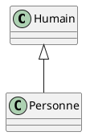

# Heritage

 <!-- .element width="20%" align="left" -->

 <!-- .element width="30%" align="right" -->

----

## Heritage

### Définition

- L'**héritage** est un **mécanisme** qui permet de **créer** une **nouvelle classe** à partir d'une **classe existante**.
- La **nouvelle classe** hérite de tous les **attributs** et **méthodes** de la **classe existante** selon leur portée.

----

## Heritage

### Les Superclasses

- La **nouvelle classe** est appelée **sous-classe** ou **classe fille**.
- La **classe existante** est appelée **super-classe** ou **classe mère**.

----

## Heritage

### En UML



> Copiez-collez ce code sur [PlantText](https://www.planttext.com/)

----

## Heritage

### Syntaxe

- Pour hériter d'une classe, on utilise le mot clé `extends` suivi du nom de la classe mère.

```java
public class Humain {
    // ...
}

public class Personne extends Humain {
    // ...
}
```

----

## Heritage

### Portées

- `private` : **non hérité**
- `protected` : **hérité**
- `public` : **hérité**
- `package` : **hérité** si dans le même package, sinon **non hérité**

----

## Heritage

### Exemple

```java
public class Humain {
    protected String nom;
    protected String prenom;
    
    public Humain(String nom, String prenom) {
        this.nom = nom;
        this.prenom = prenom;
    }
    
    public String getNom() {
        return this.nom;
    }
    
    public String getPrenom() {
        return this.prenom;
    }
}

public class Personne extends Humain {
    private String adresse;
    
    public Personne(String nom, String prenom, String adresse) {
        super(nom, prenom);
        this.adresse = adresse;
    }
    
    public String getAdresse() {
        return this.adresse;
    }
}
```

----

## Heritage

### Démonstration !

Des employés et des stagiaires

---

## Overload

### Définition

- Une méthode peut être **redéfinie** plusieurs fois
- On ne touche en général qu'aux paramètres
- On parle d'**overload** (ou **surcharge**)

----

## Overload

### Exemple

```java
public class Humain {
    // ...
    
    public doSomething() {
        // ...
    }
    
    public doSomething(String param) {
        // ...
    }
}
```

> Le comportement doit être similaire, mais les paramètres peuvent être différents !

----

## Surcharge de constructeur

```java
public class Humain {
    // ...

    public Humain() {
        this.nom = nom;
        this.prenom = prenom;
    }

    public Humain(String nom, String prenom, String adresse) {
        this(nom, prenom);
        this.adresse = adresse;
    }
}
```

----

## Surcharge

### Règles

- On ne peut surcharger que les methods d'une même classe
- La méthode a le même nom mais différents paramètres

> La surcharge est définie lors de la compilation

---

## Override

### Définition

- Une méthode héritée peut être **redéfinie** dans la classe fille.
- On parle de **redéfinition** (ou **override**).
- La méthode doit avoir la même signature (même nom, même paramètres) que la méthode héritée.
- Il faut ajouter l'annotation `@Override` au dessus de la méthode.

----

## Override

### Exemple

```java
public class Humain {
    // ...
    
    public String getNom() {
        return this.nom;
    }
    
    public String getPrenom() {
        return this.prenom;
    }
}

public class Personne extends Humain {
    // ...
    
    @Override
    public String getNom() {
        return "M. " + super.getNom();
    }
}
```

----

## Override

### Précisions

- La surcharge est définie lors de l'exécution (runtime)
- Ne fonctionne que lors d'un héritage
- Elle doit avec exactement la même signature (même nom, même paramètres)

----

## Override 

### ToString

- La méthode `toString` est héritée de la classe `Object`
- Elle permet de définir la représentation d'un objet sous forme de chaîne de caractères
- Elle est très souvent redéfinie

----

## Override ToString

### Exemple

```java
public class Humain {
    // ...
    
    @Override
    public String toString() {
        return this.nom + " " + this.prenom;
    }
}
```

----

## Override

### Annotation

- L'annotation `@Override` permet de vérifier que la méthode est bien redéfinie
- Si ce n'est pas une méthode héritée, une erreur est levée
- Si la méthode n'a pas la même signature, une erreur est levée
- Il n'est pas obligatoire d'utiliser cette annotation, mais c'est une **bonne pratique** !

---

# La suite !

[Index](index.html)