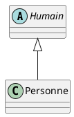

# Classe Abstraite

 <!-- .element width="20%" align="left" -->

 <!-- .element width="30%" align="right" -->

----

## Classe Abstraite

### Définition

- Désigne une **super-classe** qui ne peut pas être instanciée.
- Elle sert de **modèle** pour les **sous-classes** qui l'étendent.

----

## Classe Abstraite

### Objectifs

- **Factoriser** du **code** commun à plusieurs classes.
- **Simplifier** la **compréhension** du code.
- Créer un comportement **générique**.

----

## Classe Abstraite

### En UML



----

## Classe Abstraite

### Syntaxe

- On utilise le mot clé `abstract` devant la déclaration de la classe.

```java
public abstract class Humain {
}
```

----

## Classe Abstraite

### Syntaxe

Elle peut aussi contenir des méthodes abstraites :

```java
public abstract class Humain {
    public abstract void parler();
}
```

> Les sous classes devront alors implémenter cette méthode !

----

## Classe Abstraite

### Syntaxe

- Les implémentations devront respecter la signature de la méthode abstraite.

```java
public class Personne extends Humain {
    @Override
    public void parler() {
        System.out.println("Bonjour !");
    }
}
```

----

## Classe Abstraite

### Exemple

```java
public abstract class Humain {
    protected String nom;
    protected String prenom;
    
    public Humain(String nom, String prenom) {
        this.nom = nom;
        this.prenom = prenom;
    }
    
    public String getNom() {
        return this.nom;
    }
    
    public String getPrenom() {
        return this.prenom;
    }
    
    public abstract void parler();
}

public class Personne extends Humain {
    private String adresse;
    
    public Personne(String nom, String prenom, String adresse) {
        super(nom, prenom);
        this.adresse = adresse;
    }
    
    @Override
    public void parler() {
        System.out.println("Bonjour !");
    }
}
```

----

## Démonstration

Améliorer notre code !

---

# Interface

 <!-- .element width="20%" align="left" -->

 <!-- .element width="30%" align="right" -->

----

## Interface

### Définition

- Une interface est une **classe abstraite** dont toutes les méthodes sont abstraites.
- Elle sert à définir des abstractions sans implémentation
- Une interface ne peut pas être instanciée

----

## Interface

### Contrat

- Une interface définit un **contrat**.
- Une classe qui implémente une interface doit respecter ce contrat.
- Le contrat désigne les **méthodes** que la classe doit implémenter.

----

## Interface

### Syntaxe

```java
public interface Humain {
    public void parler();
}
```

- On utilise le mot clé `interface` devant la déclaration de la classe.
- Les méthodes n'ont pas de corps `{}`.
- On ne peut pas définir de constructeur.

----

## Interface

### Attributs

- Il est possible (mais pas recommandé) de définir des attributs.
- Les attributs sont **publics**, **statiques** et **constants**.
- Une fois hérités, ils ne peuvent pas être redéfinis.

```java
public interface Humain {
    public static final String NOM = "Humain";
}
```

> Évitez de définir des attributs dans une interface !

----

## Interface

### Accesseurs

- Il est également **possible** de définir des **accesseurs**.
- Ils sont **publics** et **abstraits**.
- Il n'est cependant pas recommandé de le faire.

```java
public interface Humain {
    public abstract String getNom();
}
```

> Évitez de définir des accesseurs dans une interface !

----

## Interface

### Et pourquoi pas ?!

- En Java, les interfaces sont **utilisées** pour définir des **compotements**.
- Les attributs, accesseurs et mutateurs sont des **détails d'implémentation**.
- Il est donc préférable de les définir dans une classe concrète, voire abstraite.

> Cette affirmation n'est pas vraie dans tous les langages !

----

## Interface

### Nomenclature

Il n'est pas rare de voir ce genre de choses : 

```java
public interface IPersonne {
    // Code
}

public class Personne implements IPersonne {
    // Code
}
```

> Bien ou pas bien ?

----

## Interface

### Nomenclature

- C'est une pratique ancienne.
- Les interfaces étaient préfixées avec un `I` pour aider les développeurs à les identifier.
- Hors, les interfaces sont là pour définir un comportement **métier**. `I` est une **notation technique**.

> En Java, il est donc inutile de préfixer les interfaces avec un `I` !

Note: https://stackoverflow.com/questions/5816951/prefixing-interfaces-with-i#:~:text=The%20%22I%22%20in%20front%20of,everyone%20expects%20you%20to%20do.

----

## Interface

### Nomenclature

- Aujourd'hui, c'est considéré comme une mauvaise pratique.
- Cependant, beaucoup de développeurs continuent de le faire, par **habitude**.

> NB : C# est une exception, car c'est une bonne pratique dans **ce** langage.

----

## Interface

### Du coup, on fait quoi ?

- On cherche des noms représentatifs !
- On réfléchit à la **sémantique** de l'interface.
- On réfléchit à la **conception**.

```java
public interface Humain {
    // ...
}
public class Personne implements Humain {
    // ...
}
```

----

## Interface

### Démonstration

Reprenons notre code depuis le début !

---

## La suite !

[Index](index.html)